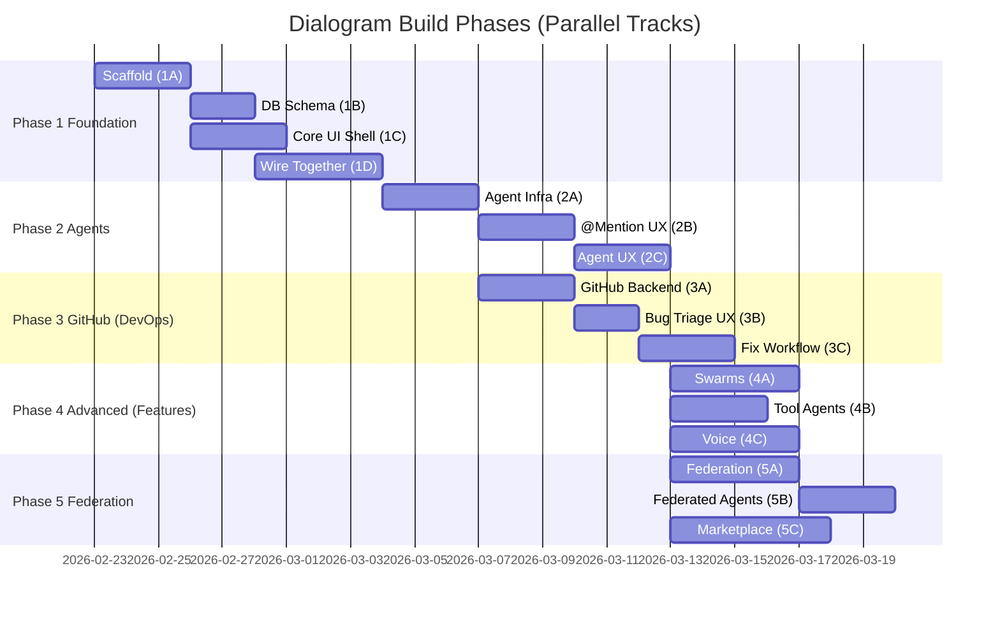

# Dialogram — Prioritized Build Plan

> **Strategy**: Each Phase is a shippable milestone. Within each phase, tasks are organized into parallel Groups (A, B, C…) that Claude Code agents can execute simultaneously. Complete an entire Group before advancing.

---

## Priority Summary

| Priority | Phase | Key Deliverable | Blocked By |
|---|---|---|---|
| 🔴 P0 | Phase 1 | Auth + Real-time CRDT Editor + Workspaces | Nothing |
| 🔴 P0 | Phase 2 | BYOM Agent Keys + @mention + Webhooks | Phase 1 |
| 🟠 P1 | Phase 3 | GitHub Bug Triage workflow | Phase 2 |
| 🟠 P1 | Phase 4 | Agent Swarms + Tool-Empowered Agents | Phase 2 |
| 🟡 P2 | Phase 4 | Voice-to-Agent | Phase 2 |
| 🟡 P2 | Phase 5 | Federation + Marketplace | Phase 2 |

---

## Phase 1 — Foundation & Core Editor *(P0 — Start Here)*

**Goal**: A real-time collaborative rich-text editor with auth, workspaces, and documents. Everything else is gated on this.

**Agents**: `@Foundation` + `@EditorCore` (run concurrently from Group 1B onward)

### Group 1A — Project Scaffold *(Parallel — Day 1)*
| # | Task | Notes |
|---|------|-------|
| 1 | Initialise Next.js 14 (App Router) + TypeScript, ESLint, Prettier, TailwindCSS | `create-next-app` |
| 2 | Set up Supabase project — Auth (email + GitHub OAuth), PostgreSQL, RLS skeleton | Include anon + service key |
| 3 | Set up Railway project for Yjs WebSocket server (Hocuspocus) | Separate service from Next.js |

### Group 1B — Database Schema *(Parallel — Day 2, all 3 concurrent)*
| # | Task | Notes |
|---|------|-------|
| 4 | Migrate `users`, `workspaces`, `workspace_members` tables | RLS policies on all |
| 5 | Migrate `documents`, `folders` tables | Soft-delete, ordering column |
| 6 | Migrate `comments`, `comment_threads` tables | Inline + document-level |

### Group 1C — Core UI Shell *(Parallel with 1B — Day 2)*
| # | Task | Notes |
|---|------|-------|
| 7 | Auth flows — Sign up, sign in, OAuth callback pages | shadcn/ui components |
| 8 | Sidebar layout — workspace switcher, folder tree, document list | Radix primitives |
| 9 | Rich text editor shell — TipTap + extensions (headings, lists, code blocks, tables, bubble menu) | Custom extensions |

### Group 1D — Wire Everything Together *(Sequential — Day 4, depends on 1B + 1C)*
| # | Task | Notes |
|---|------|-------|
| 10 | Yjs + Hocuspocus → TipTap CRDT sync with live cursor presence | Test multi-tab conflict resolution |
| 11 | Supabase auth session → Yjs awareness (user colour, name, avatar) | |
| 12 | CRUD Route Handlers for documents + folders | Optimistic UI updates |
| 13 | Inline comment highlights + threaded reply sidebar | Attach to Yjs doc state |

---

## Phase 2 — Agent Integration *(P0 — Core Differentiator)*

**Goal**: BYOM agent key system, @mention flows, webhook dispatch, and advanced agent UX.

**Agent**: `@AgentCore`

### Group 2A — Agent Infrastructure *(Parallel)*
| # | Task | Notes |
|---|------|-------|
| 14 | `agent_keys` table + API key generation (hashed storage) | Scope/permissions per key |
| 15 | Webhook dispatch engine — BullMQ queue, HMAC-signed payloads | Events: `comment.mention`, `doc.updated` |
| 16 | Agent RBAC — `reader`, `commenter`, `editor` levels via Supabase RLS | |

### Group 2B — @Mention & In-Editor UX *(Parallel, after 2A)*
| # | Task | Notes |
|---|------|-------|
| 17 | @mention TipTap extension — fuzzy autocomplete for agents + humans | |
| 18 | Agent avatar system — bot badge, distinct colour, live "typing" indicator in Yjs awareness | |
| 19 | REST API for agents to push edits + comments + OpenAPI/Swagger docs | |

### Group 2C — Agent Trust & Memory *(Parallel, after 2B)*
| # | Task | Notes |
|---|------|-------|
| 20 | Transparent Scratchpad side-panel — stream agent Chain-of-Thought via SSE | |
| 21 | Document Branching — Yjs snapshots, side-by-side diff, Approve/Reject UI | |
| 22 | Persistent agent memory — pgvector per workspace, embed doc chunks on save | |

---

## Phase 3 — Bug Triage & GitHub Integration *(P1)*

**Goal**: GitHub issues become living triage documents. Agents and humans fix bugs together.

**Agent**: `@DevOps` *(runs concurrently with Phase 4 `@Features`)*

### Group 3A — GitHub Sync Backend *(Parallel, after Phase 2)*
| # | Task | Notes |
|---|------|-------|
| 23 | `github_integrations` table + GitHub App OAuth flow | Store installation tokens per workspace |
| 24 | GitHub webhook receiver — `issues.opened`, `issues.labeled`, PR events | Verify `X-Hub-Signature-256` |
| 25 | Triage Agent trigger — new issue → queue job → auto-create Bug Triage document | Pre-filled template |

### Group 3B — Bug Triage Document UX *(Parallel, after 3A)*
| # | Task | Notes |
|---|------|-------|
| 26 | Bug Triage TipTap template — Summary, Reproduction, Affected Files, Proposed Fix, Test Results | |
| 27 | Code block RAG — GitHub API fetches relevant file snippets, embeds with diff-aware rendering | |
| 28 | "Create Pull Request" button — GitHub API creates branch + PR prefilled from doc | |

### Group 3C — Collaborative Fix Workflow *(after 3B)*
| # | Task | Notes |
|---|------|-------|
| 29 | `@Execution Agent` sandbox — E2B isolated code execution, stream stdout to doc | |
| 30 | Two-way GitHub Issue ↔ Document sync — resolve issue closes doc; doc edits update issue | |

---

## Phase 4 — Advanced Agent Features *(P1 + P2)*

**Goal**: Agent Swarms, Tool-Empowered Agents, and Voice-to-Agent.

**Agent**: `@Features` *(runs concurrently with Phase 3 `@DevOps`)*

### Group 4A — Agent Swarms *(Parallel, after Phase 2)*
| # | Task | Notes |
|---|------|-------|
| 31 | Agent-to-Agent delegation protocol — agent @mentions another agent in webhook payload | No human required in chain |
| 32 | Swarm audit log UI — timeline sidebar showing chain of actions, collapsible per-agent | |
| 33 | Cycle detection guard — depth limit (max 5 hops) + circuit breaker, server-side | |

### Group 4B — Tool-Empowered Agents *(Parallel, after Phase 2)*
| # | Task | Notes |
|---|------|-------|
| 34 | Data connector framework — agents declare `tools[]` with JSON Schema | `sql_query`, `http_fetch`, `mermaid_render` |
| 35 | Live table renderer — agent pushes JSON → TipTap renders sortable table (custom node) | |
| 36 | Diagram renderer — agent pushes Mermaid markdown → SVG rendered in doc | |

### Group 4C — Voice-to-Agent *(Parallel, after Phase 2)*
| # | Task | Notes |
|---|------|-------|
| 37 | Voice recording UI — in-editor mic button, waveform feedback (MediaRecorder API) | |
| 38 | Transcription pipeline — Whisper API or Deepgram → structured JSON async job | |
| 39 | Listener Agent — formats transcript into structured doc sections via LLM | |

---

## Phase 5 — Federation & Marketplace *(P2)*

**Goal**: CKAN-style federation between trusted Dialogram instances + Agent Marketplace.

**Agent**: `@Federation`

### Group 5A — Federation Protocol *(Parallel)*
| # | Task | Notes |
|---|------|-------|
| 40 | `federated_nodes` table — node URL, trust level, sync frequency | Admin-managed |
| 41 | Harvester pipeline — Gather → Fetch → Import via BullMQ cron | `/.well-known/dialogram/manifest` endpoint |
| 42 | DCAT-compatible metadata schema — JSON export for docs/agents | Cross-platform interop |

### Group 5B — Federated Agent Queries *(after 5A)*
| # | Task | Notes |
|---|------|-------|
| 43 | Cross-workspace agent delegation — scoped JWT read tokens (24h expiry) | |
| 44 | Federation explorer UI — browse harvested docs/agents from peer nodes | "One-stop-shop" catalog |

### Group 5C — Agent Marketplace *(Parallel with 5A)*
| # | Task | Notes |
|---|------|-------|
| 45 | `marketplace_listings` table — name, prompt, webhook template, price, author, rating | |
| 46 | One-click install — listing → auto-provision agent_key + webhook in workspace (Stripe) | 15-20% platform commission |
| 47 | Marketplace frontend — search, filter by category, ratings, install count | |

---

## Build Timeline (Gantt)

> **Note**: Phase 3 (`@DevOps`) and Phase 4 (`@Features`) run **concurrently** — start both once Phase 2 Group 2A is complete.
